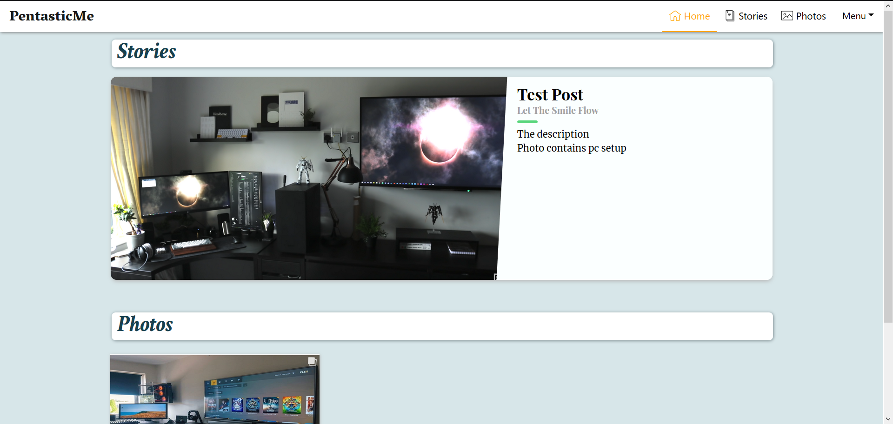
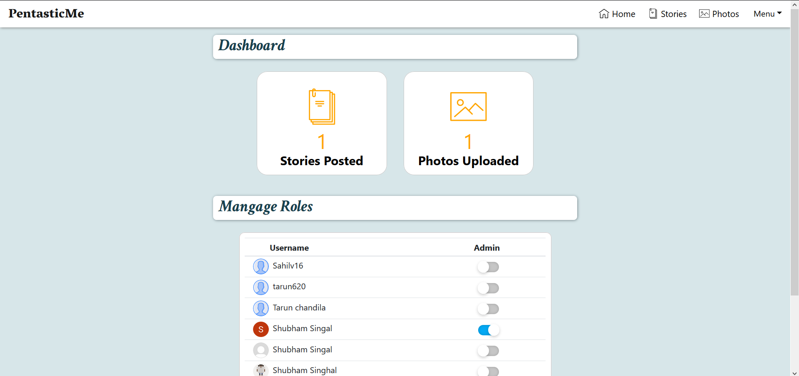

# Pentastic Me
It is a web app which can be used to write blog posts and upload images.
Only admins can write blogs or upload images

User gets various features for writing blogs like
* Add a youtube video.
* Various fonts and font size. 
* Aligining the text
* Writing piece of code in blog
* Embedding links
* Using images in blog

User gets multiple features while uploading images
* Can upload multiple images at once.
* Move the images i.e order them

## Homepage
Homepage shows the list of latest blogs and latest images.



---

## Dashboard 
Admin can manage role of the user and can check the number of posts written and images uploaded.



## Code
Frontend is made on ReactJS and Bootstrap is used for css. To start app open Frontend folder and perform the following steps.

```powershell
# Install dependencies
npm install

# Serve on localhost:3000
npm start
```


## Project Structure                       
    ├── app                                    
    |   ├── actions  
    |   ├── components          # contains reusable components      
    |   ├── containers          # contains business logic
    |   ├── controllers         
    |   ├── store               # redux store
    |   ├── styles
    |   ├── index.html          
    |   ├── index.jsx           # entry point
    |   ├── public              # public files
    |   └── ...
    ...


### Visit
You can go check out the project at https://pentasticme-frontend.herokuapp.com/


# App Info
### Author 
Shubham Singal

---

### Version 
1.0.0

